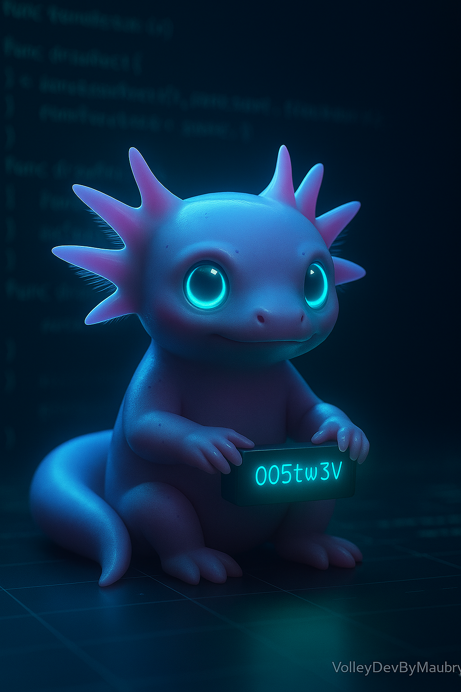

# Qyvol 🚀

<div align="center">
  
  
</div>

**Qyvol** es un runtime moderno basado en WebAssembly (WASM), diseñado para ejecutar microservicios y aplicaciones portátiles, seguras y potenciadas por IA con tiempos de arranque instantáneos. Inspirado en Docker, pero optimizado para WASM, Qyvol utiliza manifiestos `.qyv` y contenedores `.qyvbin` para orquestar módulos `.wasm`, ofreciendo una alternativa ligera a los contenedores tradicionales. Con soporte para una arquitectura poliglota (Rust, Julia, Kotlin, Nim), Qyvol es ideal para entornos edge, navegadores, servidores y dispositivos embebidos.

> Ejecuta módulos `.wasm` definidos por manifiestos `.qyv` con WASI, potenciados por orquestación basada en IA, seguridad avanzada y sistemas de archivos modulares.

---

## 📦 Estructura del Proyecto

El repositorio está organizado como un **workspace de Rust** con los siguientes paquetes:

```
Qyvol/
├── cli/          # Interfaz de línea de comandos (qyvol run, deploy, shell)
├── common/       # Estructuras compartidas (manifiestos, parser YAML, permisos)
├── runtime/      # Runtime WASM con WASI, integración de IA y redes
├── examples/     # Ejemplos de manifiestos (.qyv) y módulos (.wasm)
└── contrib/      # Código fuente de ejemplo (Rust, Julia, Kotlin) para módulos .wasm
```

---

## ✨ Primer Ejemplo: Clasificador de Imágenes con IA

Ejecuta un clasificador de imágenes basado en IA definido por un manifiesto `.qyv`:

```sh
cargo run -p cli -- run examples/classifier.qyv
```

### ✅ Salida Esperada

```
▶ Iniciando Qyvol Runtime...
🔧 Cargando módulo: imagenet-classifier
📂 Ruta WASM: examples/./model.wasm
📋 Lenguaje: Julia
📋 Importaciones:
  - wasi_snapshot_preview1::fd_write
  - ai::inference
📋 Exportaciones:
  - memory
  - _start
  - classify
🔍 Permisos: fs:read-only, net:false, ai:true
🧠 Ejecutando inferencia en /data/sample.jpg...
✅ Clasificación: "Gato" (confianza: 0.92)
✅ Ejecución completada
```

### 📄 Ejemplo de Manifiesto `.qyv`

```yaml
name: imagenet-classifier
entrypoint: model.wasm
runtime: wasi
language: julia
permissions:
  fs: read-only
  net: false
  ai: true
env:
  MODEL_PATH: /data/imagenet.onnx
fs:
  type: memfs
```

---

## 🌟 Características Principales

- **Soporte Poliglota**: Ejecuta módulos `.wasm` compilados desde Rust, Julia, Kotlin, Nim y más.
- **Integración de IA**: Ejecuta modelos de IA embebidos (ONNX, TFLite) con Julia, tract, linfa o burn para clasificación, predicción y optimización.
- **Seguridad Basada en Capacidades**: Permisos declarativos en `.qyv` garantizan ejecución con confianza cero.
- **Sistema de Archivos Modular**: Soporte para `memfs` (RAM), `diskfs` (WASI host) y `netfs` (HTTP/WebDAV/S3).
- **Redes Virtuales**: Comunicación interna via `service://nombre/puerto` con `tokio::mpsc` y sincronización P2P usando libp2p/WebRTC.
- **Shell Predictivo**: CLI potenciada por IA (`qyvol shell`) con sugerencias contextuales.
- **Clustering Distribuido**: Orquesta instancias de Qyvol con Elixir para sincronización en edge y nube.
- **Soporte para GUI**: Ejecuta aplicaciones gráficas con Kotlin Multiplatform, Dioxus o egui, renderizadas vía WebGPU.
- **Contenedores Portátiles**: Formato `.qyvbin` empaqueta `.wasm`, manifiestos y recursos firmados para despliegue instantáneo.

---

## 📄 Formato de Manifiesto `.qyv`

Los manifiestos están escritos en YAML y definen la ejecución, permisos y entorno del módulo. Ejemplo para una aplicación gráfica:

```yaml
name: editor-texto
entrypoint: editor.wasm
runtime: wasi
language: kotlin
permissions:
  fs: read-write
  net: false
  gfx: true
type: gui
```

---

## ⚙️ Requisitos

- Rust (1.80+ recomendado)
- Binarios `.wasm` compatibles con WASI
- `cargo install cargo-edit` (para `cargo add`)
- `wasmtime` o `wasmedge` (integrados en el runtime)
- Opcional: Julia (para módulos de IA), Kotlin (para GUI), Elixir (para clustering)

---

## 🛠️ Dependencias

- [`serde`](https://crates.io/crates/serde), [`serde_yaml`](https://crates.io/crates/serde_yaml) – Parseo de YAML
- [`clap`](https://crates.io/crates/clap) – Parseo de argumentos CLI
- [`colored`](https://crates.io/crates/colored) – Salida colorida en terminal
- [`wasmtime`](https://crates.io/crates/wasmtime) – Ejecución WASM con WASI
- [`tokio`](https://crates.io/crates/tokio) – Runtime asíncrono para redes
- [`reqwest`](https://crates.io/crates/reqwest) – HTTP para `netfs`
- [`tract-onnx`](https://crates.io/crates/tract-onnx) – Ejecución de modelos de IA
- [`libp2p`](https://crates.io/crates/libp2p) – Redes P2P
- [`ring`](https://crates.io/crates/ring) – Firmas criptográficas para `.qyvbin`

---

## 📌 Estado Actual

✅ **Funcionalidades Implementadas**:

- Parseo de manifiestos `.qyv`
- Ejecución de módulos `.wasm` con WASI
- Visualización de importaciones/exportaciones de módulos
- CLI básica (`qyvol run`)
- Ejemplos funcionales (e.g., `hello.wasm`, `classifier.wasm`)

🧠 **Próximos Pasos**:

- CLI avanzada (`qyvol deploy`, `qyvol shell`, `qyvol cluster`)
- Soporte para contenedores `.qyvbin` con firmas digitales
- Planificador basado en IA con Julia/linfa
- Sistema de archivos modular (`memfs`, `diskfs`, `netfs`)
- Redes virtuales con `tokio::mpsc` y libp2p
- Integración de GUI con Kotlin/Dioxus/egui
- Clustering distribuido con Elixir
- Dashboard web para monitoreo
- QyvolHub para módulos `.wasm` públicos

---

## 🧪 Roadmap de Desarrollo

1. **Fase 1: Runtime Base (2-3 meses)**

   - Comandos CLI avanzados
   - Soporte para `.qyvbin`
   - Integración básica de IA (tract, Julia)

2. **Fase 2: Redes y Seguridad (3-4 meses)**

   - Redes virtuales (`tokio::mpsc`, libp2p)
   - Permisos basados en capacidades
   - Sistema de archivos modular

3. **Fase 3: IA y GUI (3-5 meses)**

   - Shell predictivo con Julia
   - Planificador basado en IA
   - Soporte para GUI (Kotlin, Dioxus)

4. **Fase 4: Ecosistema (3-5 meses)**
   - Repositorio público QyvolHub
   - Clustering distribuido con Elixir
   - Dashboard web y modo educativo

**Total**: 12-18 meses para un MVP completo, reducible con contribuciones open source.

---

## 🧙 Autor

**VolleyDevByMaubry**  
Creado con pasión por WebAssembly, inteligencia artificial y computación moderna.

---

## 🤝 Contribuciones

¡Las contribuciones son bienvenidas! Consulta [CONTRIBUTING.md](CONTRIBUTING.md) para guías sobre cómo enviar issues, pull requests o nuevos módulos `.wasm`.

---

## 📜 Licencia

Licencia MIT. Revisa [LICENSE](LICENSE) para más detalles.

---

_Potenciado por 💡 Rust, 🚀 WebAssembly, 🧠 Julia y más. Construido para el futuro de la computación._
